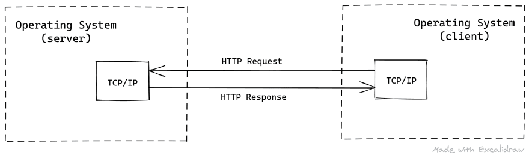
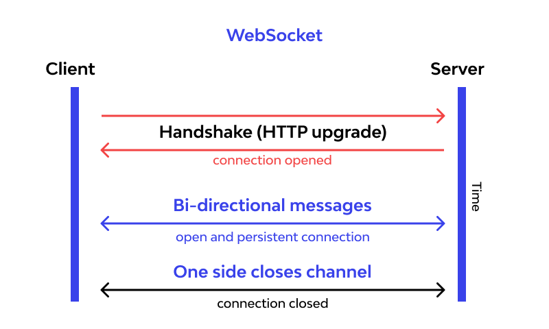
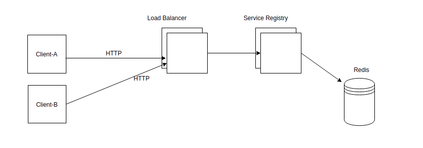
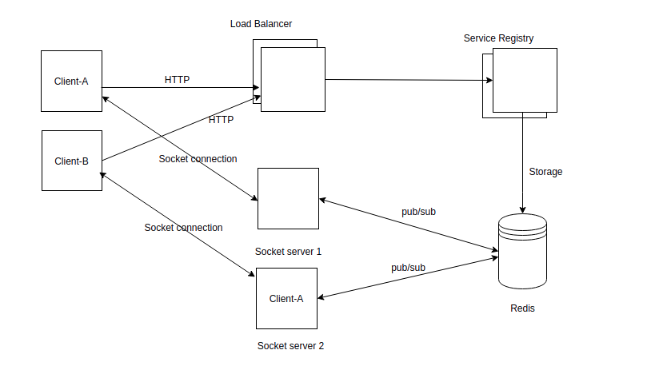
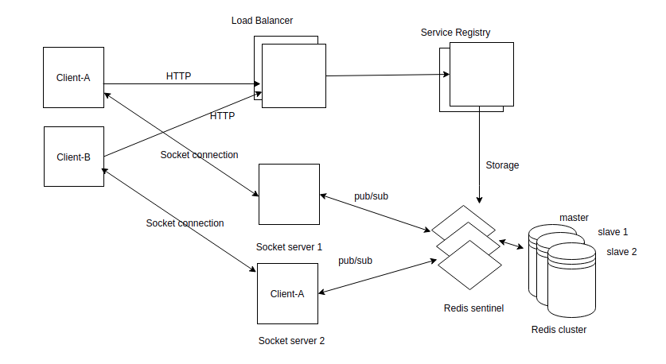
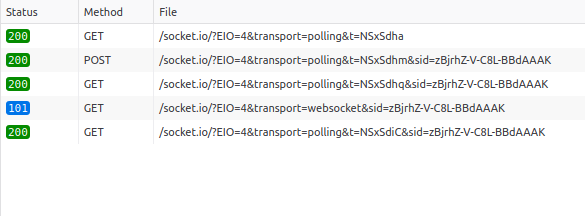
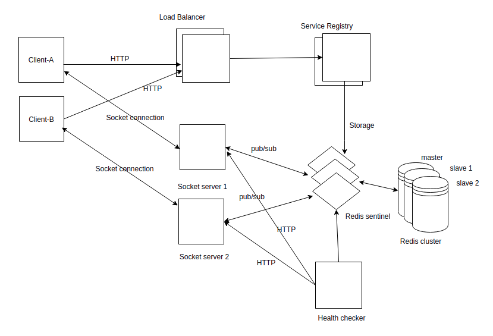
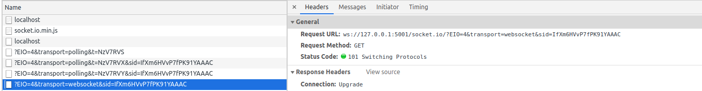
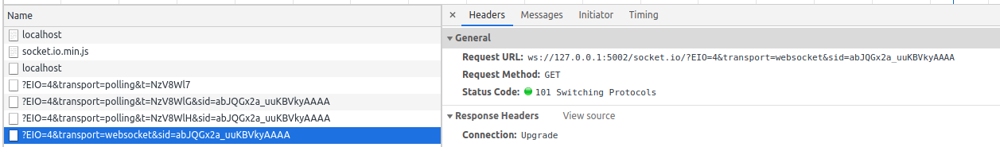

# Design Scalable Chat System

Topics

1. Problem discussion
    - How web socket works?
    - Limitations of socket connection.
2. High level design overview
3. Design service registry
4. Load balancing with nginx for service registry
5. Design socket server
6. Introduce redis pub/sub with socket servers
7. Scale redis with sentinel
8. Design client service
9. Design socket health checker service
10. Configure docker compose file

# Problem Discussion
HTTP protocol: HTTP is a *stateless* protocol that runs on top of TCP which is a connection-oriented protocol it guarantees the delivery of data packet transfer using the three-way handshaking methods and re-transmits the lost packets.It is a *unidirectional* where the client sends the request and the server sends the response. Let’s take an example when a user sends a request to the server this request goes in the form of HTTP or HTTPS, after receiving a request server send the response to the client, each request is associated with a corresponding response, after sending the response the connection gets closed, each HTTP or HTTPS request establish the new connection to the server every time and after getting the response the connection gets terminated by itself. 



WebSocket: WebSocket is a *stateful* protocol, which means the connection between client and server will keep alive until it is terminated by either party (client or server). After closing the connection by either of the client and server, the connection is terminated from both ends. WebSocket is *bidirectional*, a full-duplex protocol that is used in the same scenario of client-server communication, unlike HTTP it starts from ws:// or wss://. 

whenever we initiate the connection between client and server, the client-server made the handshaking and decide to create a new connection and this connection will keep alive until terminated by any of them.

This is how after client-server handshaking, the client-server decide on a new connection to keep it alive, this new connection will be known as WebSocket. Once the communication link establishment and the connection are opened, message exchange will take place in bidirectional mode until connection persists between client-server.



### Issue with socket connection:
One important point is when a socket connection established, the connection will persist untill server or client terminates.We know at a given time, server can have a fix amount of tcp connections.So, when the system grows, more servers are required to server the users.We can think, if we put n number of socket servers behind a layer-7 load balancer(Ex: nginx), which will distribute the connection requests may solve the problem.

No, there are still some issues like:
- Load balancer also have tcp connection limit
- Unable to detect which server has already exceeded connection limit

# High level design overview
What if we remove load balancer from the front line of socket servers and put it in front of an intermidiate server called service registry.When a client wants to establish socket connection, it will request the service registry first and service registry will check which socket server is able to accept new socket connection and tell the client to connect to that healthy socket server.

# Design service registry
The main responsibility of this service is to instruct a client to which socket server to connect. Whenever, we add a new socket server to the system, we'll notify this sevice. It will keep track of available socket servers and their total socket connection in redis server in a sorted manner by connection. We'll use MinHeap data structure to keep those socket servers records which is implemented as *Sorted Set* in redis. So, when a client will request for socket server address, it will take first element from the *Sorted Set*.

# Load balancing with nginx for service registry
if we have millions of users, we can't serve those users from a single service registry service. So, to overcome this limitations we can scale horizontally the service registry service by increasing number of servers and introduce layer-7 load balancer(nginx/haproxy/apache etc) in front of those servers to distibute the load.At this point, we've got:


# Design socket server
This service is simple web socket server which accepts socket connection.It has some additional responsibilities like when a new connection will establish successfully, it will increase its connection count in redis server. Similarly, if a connection closed or terminates it will decrease its connection count.

# Introduce redis pub/sub with socket servers
Socket connection management is not going to be a problem since we are using multiple socket servers and connection load is balanced because of our service registry service. But there is issue, consider this scenario:

Suppose, user-A connects to a socket server let's say socket-server-1. and another user, user-B connects to a socket server let's say socket-server-2. Now, if user-A wants to send message to user-B, is it possible with our current setup?

No, because socket-server-1 has no knowledge about user-B since user-B is connected with socket-server-2. So, we need a mechanism to pass the message to socket-server-2.

We'll use pub/sub message broker among those socket servers where every socket server will act as publisher and subscriber. Since, we are already using redis for tracking socket server, we can also use it as our pub/sub message broker. 


# Scale redis with sentinel
We are using redis for two purposes, as data storage and pub/sub broker.If we use only one redis server and if this redis server fails for some reasons, our whole system will crash.So, we need to deploy multiple redis server in different availability regions.

To achieve higher availability we can have one master Redis node and multiple slave Redis nodes(at least 2 is recommended). Changes in the master will be replicated to slaves asynchronously.When the master node fails, one of the slave nodes will be promoted as new master.

So, what is redis sentinel?
> Redis Sentinel provides high availability for Redis. In practical terms this means that using Sentinel you can create a Redis deployment that resists without human intervention certain kinds of failures. 

- It constantly checks if your master and replica instances are working as expected.

- If a master is not working as expected, Sentinel can start a failover process where a replica is promoted to master, the other additional replicas are reconfigured to use the new master, and the applications using the Redis server are informed about the new address to use when connecting.

- Sentinel acts as a source of authority for clients service discovery: clients connect to Sentinels in order to ask for the address of the current Redis master responsible for a given service. If a failover occurs, Sentinels will report the new address.

- Sentinel can notify the system administrator, or other computer programs, via an API, that something is wrong with one of the monitored Redis instances.

Isn't redis sentinel itself a single point of failure?

Yes, if we deploy only one sentinel process, it may fail. To solve this issue, we'll deploy 3 sentinel processes and internally they will co-operate and manage the failover process.

To learn more, please have a look here [Redis Sentinel](https://redis.io/topics/sentinel)



# Design client service
The socket client service can be a mobile/web/desktop application.For the first time, it will call the service registry to give one of the socket server's address. After getting the address, it will open a TCP connection through HTTP long polling protocol and then try to upgrade the protocol to web socket. If socket connection is not possible it will fall back to HTTP long polling.This upgrade process will look like this:



# Design socket health checker service
We need a service that will check periodically if any socket server is reachable or not. If the service is unreachable then it will remove the socket server from the Redis store. Otherwise, the service registry won't know about the socket server's failure.

After integrating the healt checker service,the final architecture will be:



# Configure docker compose

```
# version of docker-compose
version: '3'

# list of serices and their configuration
services:
  # redis master node
  redis:
    image: 'bitnami/redis:latest'
    environment:
      - REDIS_REPLICATION_MODE=master # declare as master
      - ALLOW_EMPTY_PASSWORD=yes # not recomended on production
    networks:
      - socket_network
    ports:
      - '6379'

  # redis slave 1 
  redis-slave-1:
    image: 'bitnami/redis:latest'
    environment:
      - REDIS_REPLICATION_MODE=slave # declare as slave
      - REDIS_MASTER_HOST=redis
      - ALLOW_EMPTY_PASSWORD=yes
    ports:
      - '6379'
    depends_on:
      - redis
    networks:
      - socket_network

  # redis slave 2  
  redis-slave-2:
    image: 'bitnami/redis:latest'
    environment:
      - REDIS_REPLICATION_MODE=slave # declare as slave
      - REDIS_MASTER_HOST=redis
      - ALLOW_EMPTY_PASSWORD=yes
    ports:
      - '6379'
    depends_on:
      - redis
    networks:
      - socket_network

  # 3 redis sentinel    
  redis-sentinel:
    image: 'bitnami/redis-sentinel:latest'
    environment:
      - REDIS_MASTER_HOST=redis
      - REDIS_MASTER_SET=mymaster # redis instances identification
    depends_on:
      - redis
      - redis-slave-1
      - redis-slave-2
    ports:
      - '26379-26381:26379' # 3 port will be occupied when we scale 3 sentinel process
    networks:
      - socket_network

  # socket server 1
  socket_1:
    restart: on-failure
    build: ./socket/socket_1
    ports:
      - '5001:5001'
    environment:
      - redis_host=redis-sentinel
    depends_on:
      - redis-sentinel
    networks:
      - socket_network

  # socket server 2
  socket_2:
    restart: on-failure
    build: ./socket/socket_2
    ports:
      - '5002:5002'
    environment:
      - redis_host=redis-sentinel
    depends_on:
      - redis-sentinel
    networks:
      - socket_network

  # client server
  socket_client:
    restart: on-failure
    build: ./socket_client
    ports:
      - '3000:3000'

  # service registry
  service_registry_1:
    restart: on-failure
    build: ./service_registry_1
    environment:
      - redis_host=redis-sentinel
    depends_on:
      - redis-sentinel
    networks:
      - socket_network

  # nginx for multiple service registry
  registry_nginx:
    build: ./nginx
    ports:
      - '80:80'
    depends_on:
      - service_registry_1
    networks:
      - socket_network

  # health_checker service
  health_checker:
    restart: on-failure
    build: ./health_checker
    environment:
      - redis_host=redis-sentinel
      - interval=1 # in every 1 minute, it will check all socket servers
    depends_on:
      - redis-sentinel
    ports:
      - 8000:8000
    networks:
      - socket_network

networks:
  socket_network:
    driver: bridge

```

To run all the containers:
```
docker-compose up --scale redis-sentinel=3
```
Now, we need to add socket server address to the service registry.To add, open your browser and hit this url:

> http://localhost/add_socket/?host=http://127.0.0.1:5001
> http://localhost/add_socket/?host=http://127.0.0.1:5002

It will add two socket servers to the registry.
If, we want to establish socket connection. Open a new tab and open the network inspect by ctrl+shift+i and visit
> http://localhost:3000/

If you closely look the network tab, you should see that socket connection is established with   :http://127.0.0.1:5001



Now, if you open another tab and follow the previous step, you should now connect with http://127.0.0.1:5002



You can also send message through socket


## Tech stack used in this project
- Node.js
- Socket.io
- Ioredis
- Express.js
- Nginx
- Docker

## Reference

Scalable web socket
- https://hackernoon.com/scaling-websockets-9a31497af051

Socket.io
- https://socket.io/

Redis Adapter
- https://socket.io/docs/v4/redis-adapter/

Redis sentinel
- https://redis.io/topics/sentinel

Redis sentinel docker image
- https://hub.docker.com/r/bitnami/redis-sentinel

Redis pub/sub
- https://redis.io/topics/pubsub